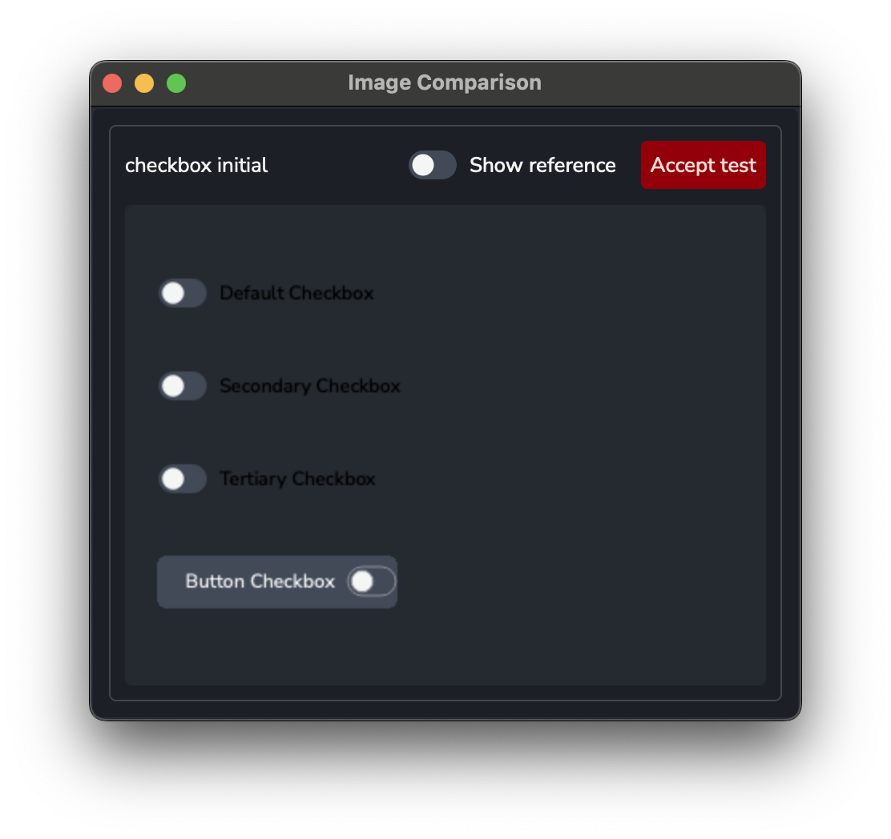
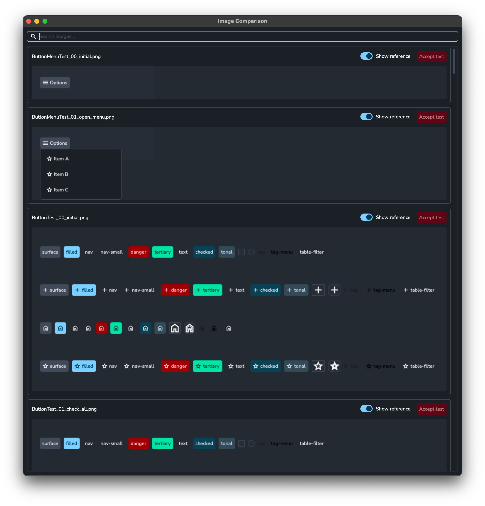

# UI Testing

This module uses **visual regression testing** to verify that UI components render correctly. Tests run headlessly using Qt's offscreen platform, capture widget screenshots, and compare them against stored reference images.

## Prerequisites

Install the test dependencies (defined in `pyproject.toml` under `[project.optional-dependencies]`):

```bash
pip install -e ".[test]"
```

This installs:

| Package | Purpose |
| --- | --- |
| `pytest` | Test runner |
| `pytest-qt` | Qt widget lifecycle helpers (`qtbot`) |
| `pytest-regressions[image]` | Image snapshot comparison |

## Running Tests

Run the full UI test suite:

```bash
pytest tests/client/ayon_core/ui/
```

Generate (or regenerate) reference images when adding new tests or intentionally changing component appearance:

```bash
pytest tests/client/ayon_core/ui/ --force-regen
```

When tests fail due to pixel differences, open the visual comparison viewer to inspect results and optionally accept them as new baselines:

```bash
pytest tests/client/ayon_core/ui/ --show-images
```



## Test Structure

```text
tests/client/ayon_core/ui/
├── conftest.py          # Sets QT_QPA_PLATFORM=offscreen before any Qt import
├── test_visual.py       # Auto-discovering runner — generates parametrized tests
├── visual_utils.py      # capture_widget() helper
├── widget_test.py       # WidgetTest base class
├── components/          # One test_*.py file per component
│   ├── test_buttons.py
│   └── test_check_box.py
├── utils/               # Shared test utilities
│   └── composite_widget.py
└── test_visual/         # Reference PNG snapshots (committed to version control)
    ├── ButtonTest_00_initial.png
    ├── ButtonTest_01_check_all.png
    └── ...
```

### Headless rendering

`conftest.py` sets `QT_QPA_PLATFORM=offscreen` before any Qt import happens. This allows all tests to run without a display server or visible windows.

### Test runner (`test_visual.py`)

The runner scans `tests/client/ayon_core/ui/components/` for any module whose name starts with `test_`, imports it, and collects all `WidgetTest` subclasses. For each class it generates two groups of pytest items:

- **`test_initial`** — snapshot of the widget in its initial state before any steps are applied.
- **`test_steps`** — one parametrized test per step callable, applied cumulatively up to and including the current step.

### Snapshot naming

Reference images are saved in `tests/client/ayon_core/ui/test_visual/` with the filename pattern:

```text
{ClassName}_{index:02d}_{step_name}.png
```

- Index `00` is always the initial state.
- Subsequent indices correspond to each step in the order returned by `steps()`.

**Examples:**

| Filename | Meaning |
| --- | --- |
| `ButtonTest_00_initial.png` | `ButtonTest` initial state |
| `ButtonTest_01_check_all.png` | After `check_all` step |
| `CheckBoxTest_02_uncheck_all.png` | After second step (`uncheck_all`) |

## Writing a New Component Test

1. Create `tests/client/ayon_core/ui/components/test_<component>.py`.
2. Subclass `WidgetTest` and implement `build()`. Optionally implement `steps()`.

```python
# tests/client/ayon_core/ui/components/test_my_widget.py
from qtpy.QtWidgets import QWidget
from widget_test import WidgetTest
from ayon_core.ui.components.my_widget import AYMyWidget


class MyWidgetTest(WidgetTest):
    size = (600, 400)       # optional: widget dimensions in pixels
    tolerance = 0.0         # optional: per-pixel diff tolerance (0.0–1.0)

    def build(self) -> QWidget:
        self._widget = AYMyWidget()
        return self._widget

    def enabled(self) -> None:
        """Step: enable the widget."""
        self._widget.setEnabled(True)

    def disabled(self) -> None:
        """Step: disable the widget."""
        self._widget.setEnabled(False)

    def steps(self):
        return [self.enabled, self.disabled]
```

3. Generate reference images for the new test:

```bash
pytest tests/client/ayon_core/ui/test_visual.py -k MyWidgetTest --force-regen
```

4. Commit the generated PNG files from `tests/client/ayon_core/ui/test_visual/`.

### `WidgetTest` API

| Attribute / Method | Description |
| --- | --- |
| `size: tuple[int, int]` | Widget dimensions applied before the first snapshot. Default: `(800, 600)`. |
| `tolerance: float` | Per-pixel diff tolerance passed to `image_regression.check()`. Default: `0.0`. |
| `build() -> QWidget` | **Required.** Create and return the widget under test. Store references to sub-widgets you'll mutate in `steps()` as instance attributes. |
| `steps() -> list[Callable]` | Return an ordered list of callables that mutate widget state. Each callable is called once and followed by a snapshot. Default: `[]` (initial snapshot only). |

### `capture_widget` utility

`visual_utils.capture_widget(widget)` renders a widget to PNG bytes using `widget.grab()`, which works under offscreen rendering without a visible window. The result is passed directly to `image_regression.check()`.

## How Snapshot Comparison Works

`pytest-regressions` stores reference images alongside the test directory. On first run (or with `--force-regen`), it saves the captured image as the new baseline. On subsequent runs it compares the captured image pixel-by-pixel against the baseline and fails if any pixel differs beyond the configured `tolerance`.

To update a baseline after an intentional visual change:

```bash
pytest --force-regen -k <TestClassName>
```

## Inspecting Failed Image Comparisons (`--show-images`)

Pass `--show-images` to open a Qt window after the test run that displays every failed image comparison side-by-side.

```bash
pytest tests/client/ayon_core/ui/ --show-images
```

The viewer is launched in a subprocess without `QT_QPA_PLATFORM=offscreen` so it renders to a real display. For each failure it shows:

- The **test name** as a heading.
- A **Test / Ref toggle** — click either button to swap between the obtained screenshot and the stored reference.
- An **Accept test** button — copies the obtained image over the reference in `tests/client/ayon_core/ui/test_visual/`, effectively accepting the new appearance as the new baseline. The button is disabled after clicking to prevent accidental double-acceptance.

`--show-images` has no effect when all tests pass.

## Looking at all reference images (`--show-refs`)

You can also view all reference images without running tests:

```bash
python tests/client/ayon_core/ui/visual_utils.py --show-refs
```



This is useful for verifying that the reference images are correct.

The viewer is the same as the one used with `--show-images`.

